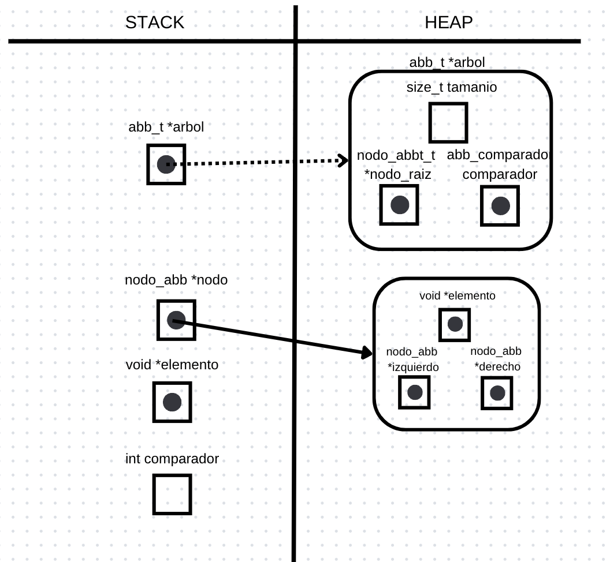
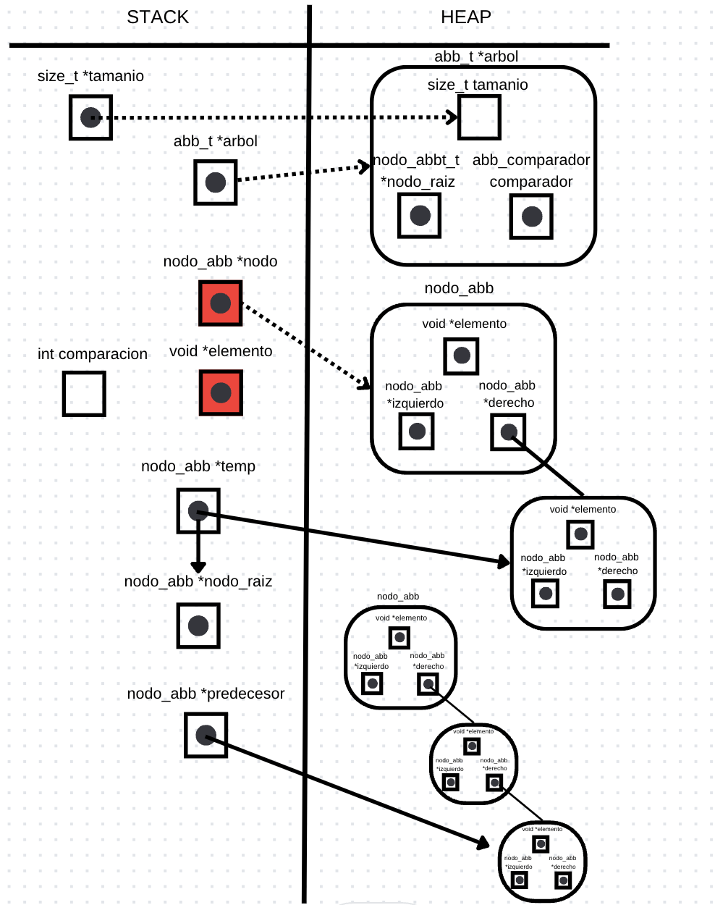

# TDA ABB

## Repositorio de Renata Bruno - 106860 - rc.brunoo@gmail.com

- Para compilar:

```bash
gcc -o pruebas_alumno pruebas_alumno.c
```

- Para ejecutar:

```bash
./pruebas_alumno 
```

- Para ejecutar con valgrind:
```bash
valgrind ./pruebas_alumno 
```
---
##  Funcionamiento

La funcion **abb_insertar**:
Recibe un arbol y un elemento. Si el arbol no existe, devuelve NULL. Si el arbol esta vacio, crea un nodo con el elemento y lo inserta en el arbol. Si el arbol no esta vacio, se procede a recorrer el árbol para encontrar la ubicación adecuada para insertar el nuevo elemento. Comienza desde el nodo raíz y sigue avanzando hacia la izquierda o la derecha según el valor del elemento y el comparador proporcionado (arbol->comparador) para determinar la ubicación correcta. Una vez que se encuentra la ubicación adecuada, el nuevo nodo se configura con el elemento dado y sus punteros izquierdo y derecho se establecen en nulo. Luego, se actualiza el puntero izquierdo o derecho del nodo actual para que apunte al nuevo nodo, y se incrementa el tamaño del árbol. La función retorna el puntero al árbol modificado.

<div align="center">

</div>

La función **abb_buscar**: 
Se utiliza para buscar un elemento específico y devuelve un puntero al elemento si se encuentra o nulo si no se encuentra. 
Recibe un arbol y un elemento. Si el arbol no existe, devuelve NULL. Se llama a la función buscar_nodo para realizar la búsqueda del elemento en el árbol, la cual es una función recursiva, donde si el nodo es nulo significa que se llego a un nodo hoja y el elemento no se ha encontrado, por lo que retorna NULL. Luego, se calcula la comparación entre el elemento deseado y el elemento en el nodo actual utilizando el comparador proporcionado (arbol->comparador). Si el comparador es cero significa que se encontro el elemento, y devuelve el nodo. Si el comparador es menor que cero, se llama a la función nuevamente con el nodo izquierdo del nodo actual. Si el comparador es mayor que cero, se llama a la función, pero con el nodo derecho del nodo actual. Si esa funcion retorna distinto de NULL, retorno el elemento del nodo, sino retorno NULL.

<div align="center">

</div>

La función **abb_quitar**: 
Se utiliza para eliminar un elemento específico y devuelve el elemento eliminado o nulo si no se encuentra.
Se verifica que el arbol exista, que el arbol tenga un nodo raiz (no vacio) y ademas se utiliza la funcion buscar, para verificar que el elemento que quiero eliminar exista en el arbol, si ninguno de esos casos se cumple, la funcion retorna NULL. Luego si el elemento a eliminar el la raiz del arbol, se almacena el elemento en una variable y se llama a abb_quitar_recursivo para realizar la eliminación y retorno el elemento eliminado.
Si el elemento a eliminar no es la raiz, se llama a la funcion abb_quitar_recursivo para realizar la eliminación, luego verifico si el nodo raíz cambia como resultado de la eliminación, y actualizao el puntero al nodo raíz del árbol. Por ultimo retorno el elemento eliminado. 
La funcion **abb_quitar_recursivo** compara el elemento deseado con el elemento en el nodo actual usando la función de comparación. Si el elemento es menor que el elemento en el nodo actual, se realiza una llamada recursiva en el subárbol izquierda. Si el elemento es mayor que el elemento en el nodo actual, se realiza una llamada recursiva en el subárbol derecho. Y si el elemento es igual al elemento en el nodo actual, se manejan tres casos:
1) Si el nodo no tiene un hijo izquierdo, se libera la memoria del nodo actual y se disminuye el tamaño del árbol. Luego se retorna el hijo derecho como el nuevo nodo en su lugar.
2) Si el nodo no tiene un hijo derecho, se libera la memoria del nodo actual y se disminuye el tamaño del árbol. Luego se retorna el hijo izquierdo como el nuevo nodo en su lugar.
3) Si el nodo tiene dos hijos (izq y der), se encuentra el predecesor del nodo, se copia su valor al nodo actual y se elimina el predecesor del subárbol izquierdo llamando recursivamente abb_quitar_recursivo en el subárbol izquierdo.

<div align="center">

</div>
---

## Respuestas a las preguntas teóricas
Que es un arbol?
Un arbol es una colección de nodos. Los nodos son los elementos o vértices del árbol, donde existe un nodo raíz, y cero o muchos subárboles no vacíos. El nodo raíz de cada subárbol es denominado nodo hijo del nodo r (raíz), y r es el nodo padre de cada subárbol de r.

Que es un arbol binario?
Un árbol binario es un árbol en el que cada nodo puede tener como máximo dos hijos. Los hijos se denominan hijo izquierdo e hijo derecho con respecto del nodo raíz. El hijo izquierdo es el hijo que aparece en la posición izquierda cuando se representa el árbol. El hijo derecho es el hijo que aparece en la posición derecha cuando se representa el árbol. Esta nocion de arbol binario esta relacionada con las operaciones de busqueda.

Que es un arbol binario de busqueda?
Un árbol binario de búsqueda es un árbol binario que puede estar vacio o en cada nodo contener un valor clave que cumpla:
- Todos los valores del subárbol izquierdo (si existen) son menores que la clave del nodo padre.
- Todos los valores del subárbol derecho (si existen) son mayores que la clave del nodo padre.
- Los subárboles izquierdo y derecho también son árboles binarios de búsqueda.

Operaciones basicas:
- Crear un arbol vacio. **Complejidad: es O(1)**, ya que solo implica crear una estructura de tipo arbol vacia, por lo que es una operacion de tiempo constante.
- Destruir un arbol. **Complejidad: es O(n)**, ya que implica recorrer todos los nodos del arbol y liberar la memoria de cada uno de ellos, por lo que es una operacion de tiempo lineal.
- Insertar un elemento. **Complejidad: depende del equilibrio del arbol**, en el peor caso (que no este equilibrado) es **O(n)**, ya que implica recorrer todos los nodos del arbol hasta encontrar el lugar donde insertar el elemento, por lo que es una operacion de tiempo lineal. Pero en el mejor caso (equilibrado) es **O(log n)**, ya que implica recorrer solo una rama del arbol hasta encontrar el lugar donde insertar el elemento, por lo que es una operacion de tiempo logaritmico.
- Buscar un elemento. **Complejidad: depende del equilibrio del arbol**, al igual que la operacion de insercion. Si esta equilibrado es **O(log n)**, si no lo esta es **O(n)**.
- Eliminar un elemento. **Complejidad: depende del equilibrio del arbol**, al igual que la operacion de insercion y busqueda. Si esta equilibrado es **O(log n)**, si no lo esta es **O(n)**.
- Recorrer un arbol. **Complejidad: es O(n)**, ya que implica recorrer todos los nodos del arbol, por lo que es una operacion de tiempo lineal.
- Saber si un arbol esta vacio. **Complejidad: es O(1)**, ya que solo implica verificar si el arbol esta vacio, por lo que es una operacion de tiempo constante.

Por qué es importante la distinción de cada uno de estos diferentes tipos de árboles?
La distincion es importante porque cada uno de estos tipos de arboles tiene sus propias caracteristicas y operaciones, por lo que es importante saber cual es el mas conveniente para cada situacion, ya sea para mejorar el rendimiento y la eficacia, como para facilitar el desarrollo. 

### Implementación y decision de diseño:
Decidi tratar las operaciones de busqueda, eliminacion y recorrido de forma recursiva, ya que me parecio mas sencillo de implementar y de entender, para lograr el resultado deseado. Por otro lado, la operacion de insercion la implemente de forma iterativa, porque no me resulto dificil de enterder ni de implementar, y me parecio que era la forma mas sencilla de hacerlo.
Del mismo modo, la funcion que destruye los nodos del arbol, tambien decidi que fuera recursiva para que se logre el correcto funcionamiento de forma mas sencilla.

Mi mayor dificultad fue el iterador interno, en principio me costo lograr que si la funcion visitar devolviera false, se detuviera el recorrido del arbol, pero luego de varias pruebas y consultas, logre que funcione correctamente.